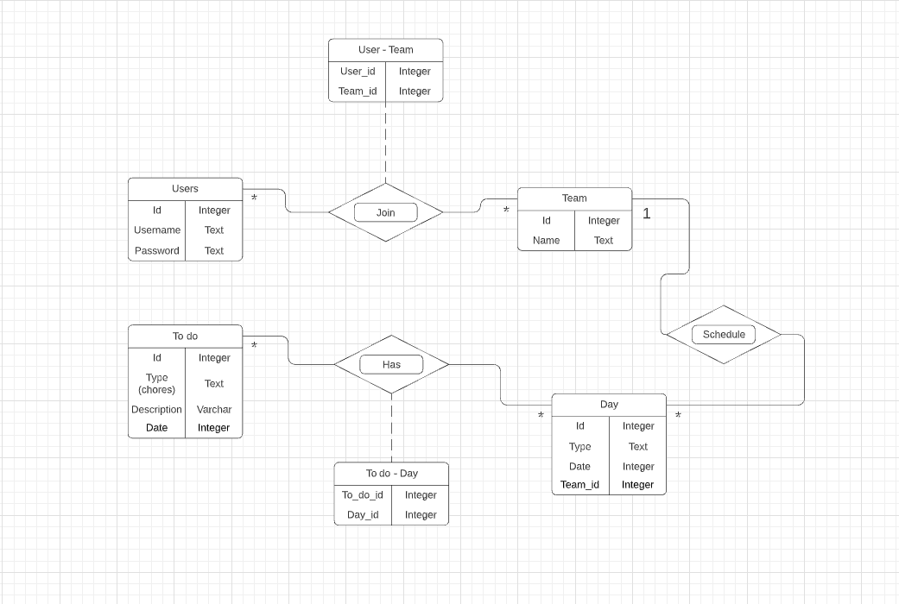

# Projektplan

## 1. Projektbeskrivning (Beskriv vad sidan ska kunna göra).
"Sysslor för familjen". Det är en app/hemsida där familjemedlemmar delar med sig av vad som behövs göras i hemmet. Det kan vara städ, matlagning, inköpslistor, kommande event m.m. Tanken är att en "familje-admin" kommer skapa en grupp, kanske med tillhörande kod, som andra "familje-användare" kan kopplas till. Man ska sedan kunna lägga till, ta bort eller uppdatera sysslor som ska göras. Dessa ska även kunna grupperas som "schema" för en dag. Admin ska kunna kicka användare ur gruppen, samt ta bort hela "scheman" (+det som användare kan göra). Användare kan lägga till, ta bort eller uppdatera event/sysslor/inköpslistor
## 2. Vyer (visa bildskisser på dina sidor).

## 3. Databas med ER-diagram (Bild på ER-diagram).

## 4. Arkitektur (Beskriv filer och mappar - vad gör/innehåller de?).
db:
Mapp med databas för projektet (slutprojekt.db). Beskrivning finns ovan (ER-diagram).

Misc:
Mapp med bilder över olika bilder, ER-diagram och skiss för projektet.

Public:
Mapp med fil för css över hemsidan (style.css).

Views (slim-filer):
    Days/index:
    Lista över dagar som en användare har tillgång till.

    Days/new:
    Lägg till ny dag för användaren (väljer datum).
    
    Days/show:
    Beskrivning av en dag. Visar alla todos (kategori, beskrivning, datum). Finns även knapp för att ta bort todo.

    Todos/new:
    Lägger till ny todo (väljer datum, kategori, beskrivning).

    Users/login:
    Funktion för att logga in (skriver in användarnamn, lösenord). Även länk till sida för att skapa ny användare

    Users/register:
    Funktion för att skapa ny användare (skriver in användarnamn, lösenord, bekräfta lösenord)

Layout:
Slim-fil över html (grundkod) för applikationen. Header-länk till style.css samt länkar till slim-filer för days/index, days/new, todos/new.

App:
Ruby-fil för kod till slim-filer. Get- och Post-routes, require (sinatra, slim, sqlite3, bcrypt), require_relative för model (ruby-fil).

Model:
Ruby-fil med funktioner kopplade till app (ruby-fil).