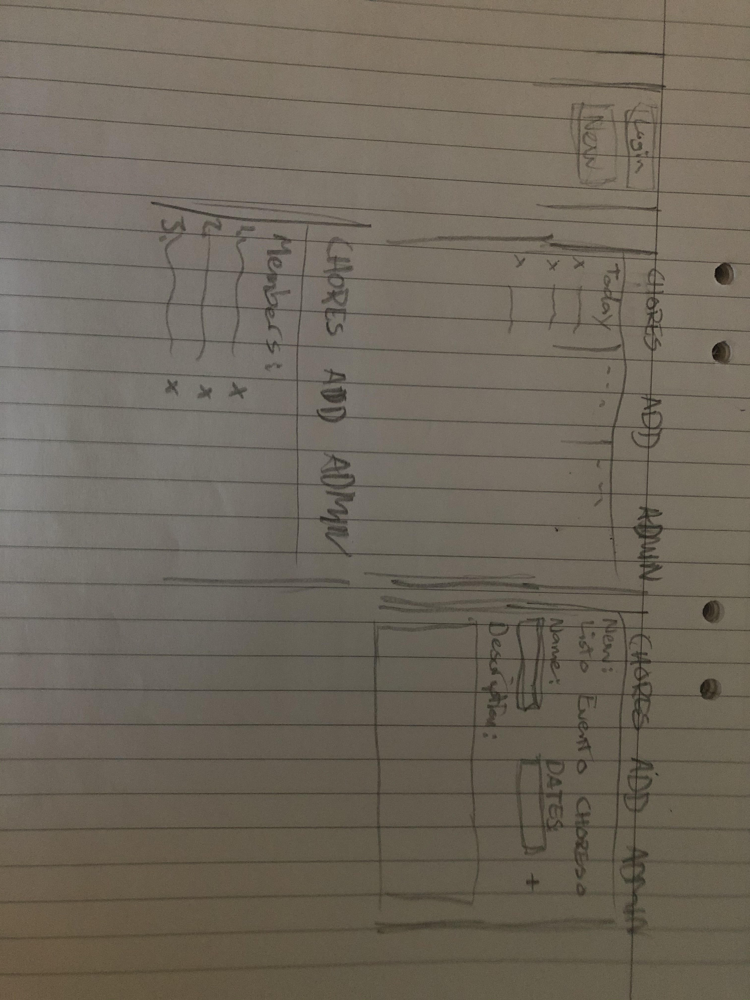
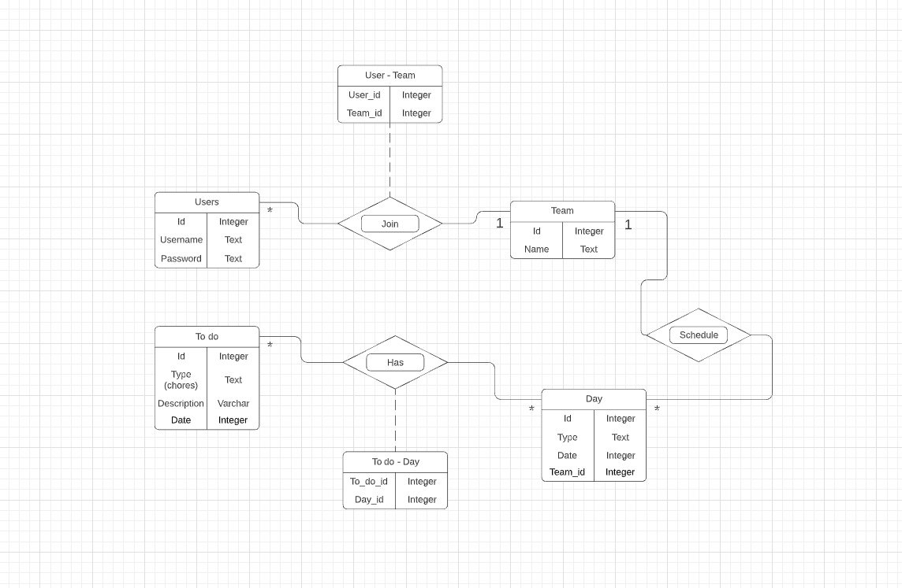

# Projektplan

## 1. Projektbeskrivning (Beskriv vad sidan ska kunna göra).
"Sysslor för familjen". Det är en app/hemsida där familjemedlemmar delar med sig av vad som behövs göras i hemmet. Det kan vara städ, matlagning, inköpslistor, kommande event m.m. Tanken är att en "familje-admin" kommer skapa en grupp, kanske med tillhörande kod, som andra "familje-användare" kan kopplas till. Man ska sedan kunna lägga till, ta bort eller uppdatera sysslor som ska göras. Dessa ska även kunna grupperas som "schema" för en dag. Admin ska kunna kicka användare ur gruppen, samt ta bort hela "scheman" (+det som användare kan göra). Användare kan lägga till, ta bort eller uppdatera event/sysslor/inköpslistor
## 2. Vyer (visa bildskisser på dina sidor).

## 3. Databas med ER-diagram (Bild på ER-diagram).

## 4. Arkitektur (Beskriv filer och mappar - vad gör/innehåller de?).

